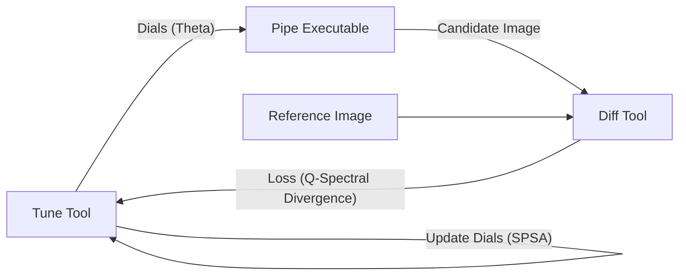

# PQTR:GeoS: Geodesic Spectrum Analysis

Automated Aesthetic Replication via Spectral Hypersphere Optimization

---

## What This Does (The Simple Version)

**Show the system any photo with a "vibe" you like. It figures out how to make your photos look like that.**

- You have a RAW photo from your camera
- You have a reference image with the mood you want (rainy day, golden hour, film noir, whatever)
- The system adjusts 45 color/tone sliders automatically to match that vibe
- Works even when the photos are completely different scenes

**Example:** You love a daytime pit lane shot you took in Austin. Feed it that shot plus your shot taken today at noon in Miami. Out comes settings that give your today shot that same feel.

**Why it works:** Every "look" has a statistical fingerprint—how bright, how saturated, which colors dominate, how contrast is distributed. Two photos can look completely different yet share the same fingerprint. The system matches fingerprints, not pixels.

**What you get:** A `.vibe` file with all 45 settings. Apply it to any future photo instantly.

---

## 1. Executive Summary

### The Objective

Automate color grading and image stylization. The system takes a source RAW image and adjusts the 45 parameters of the production pipeline (pipe) to match the aesthetic of a target reference image.

### The Challenge

| Method | Problem |
|--------|---------|
| Pixel MSE | Fails when images differ structurally (crop, rotation, different scene) |
| Histogram Matching | Loses spatial relationships, can produce flat results |
| Neural Style Transfer | Slow, introduces artifacts, requires GPU |
| Perceptual Loss (VGG) | Heavy dependency, black-box features |

### The Solution: Spectral Hypersphere Optimization

Treat an image's style as a normalized spectral signature rather than a grid of pixels. By projecting image statistics onto a unit hypersphere, we measure angular distance (geodesic) rather than Euclidean distance. This captures the distribution of light and color while remaining invariant to:

- Absolute brightness
- Spatial arrangement
- Image dimensions
- Content differences

### The Value

| Property | Benefit |
|----------|---------|
| Speed | Leverages C++ pipe (>30fps). Full optimization in <1 minute (single pass). |
| Portability | Outputs standard .vibe JSON, compatible with existing tools. |
| Robustness | Content-invariant. Works across different scenes. |
| Safety | Uses SVD on statistical features, avoiding privacy/copyright pixel leaks. |

---

## 2. Theoretical Foundation

### 2.1 Core Insight: Style as Geometry

Two images with the same "vibe" have similar statistical fingerprints even if their pixels differ entirely. We encode this fingerprint as a point on a high-dimensional unit sphere. Style similarity becomes angular proximity.

### 2.2 The Mathematics (Refined)

#### Step 1: Color Space Transform (The Safe LCH)

Convert to LCH (Lightness, Chroma, Hue).

**CRITICAL:** To prevent the "Achromatic Singularity" (where Hue swings wildly in gray areas), we apply Chroma-Weighting to the Hue channel.

$$H_{safe} = H \cdot \tanh(k \cdot C)$$

This ensures that as Chroma ($C$) $\to 0$, the Hue contribution $\to 0$, preventing noise from driving the optimization.

#### Step 2: Spectral Decomposition (SVD)

Reshape the image to matrix $A \in \mathbb{R}^{N \times 3}$.

$$A = U \Sigma V^T$$

| Component | Interpretation |
|-----------|----------------|
| $\Sigma$ (Singular Values) | Energy spectrum (Contrast magnitude) |
| $U$ (Left Singular Vectors) | Spatial-chromatic correlations |

#### Step 3: Feature Extraction

Build the style vector $\vec{v}$ from descriptors. Note the addition of Hue-Chroma Covariance to capture "Color Harmony."

```
v = [
    σ₁, σ₂, σ₃,                    # Singular values (Energy)
    μ_L, μ_C,                      # Mean Lightness/Chroma
    std_L, std_C,                  # Contrast/Saturation spread
    skew_L,                        # High-key vs Low-key distribution
    cov(L, C),                     # Does brightness correlate with saturation?
    cov(H_safe, C)                 # Do specific hues carry more saturation?
]
```

#### Step 4: Hypersphere Projection

Normalize to unit length:

$$|\psi\rangle = \frac{\vec{v}}{||\vec{v}||_2}$$

#### Step 5: Geodesic Distance (The Metric)

The loss function measures angular distance:

$$\mathcal{L} = 1 - |\langle \psi_{raw} | \psi_{ref} \rangle|^2$$

---

## 3. System Architecture

### 3.1 Component Overview



### 3.2 The Engine: pipe

- **Role:** Deterministic image generator.
- **Throughput:** 30fps+ (Headless).
- **Interface:** Accepts 45 normalized floats $[0, 1]$.

### 3.3 The Observer: diff

- **Role:** Compute spectral loss.
- **Optimization:** Uses OpenCV cv::SVD (CPU optimized) on 512x512 thumbnail proxies. Execution time < 5ms.

### 3.4 The Driver: tune

- **Role:** Optimization Loop.
- **Algorithm:** SPSA (Simultaneous Perturbation Stochastic Approximation).
- **Efficiency:** Estimates gradient of 45 parameters with 2 measurements.

---

## 4. SPSA Algorithm Details

### 4.1 The Update Rule

At iteration $k$:

1. Generate perturbation vector $\Delta_k \in \{-1, +1\}^{45}$ (Bernoulli).
2. Evaluate Loss at two points:
   - $L^+ = \text{Loss}(\theta_k + c_k \Delta_k)$
   - $L^- = \text{Loss}(\theta_k - c_k \Delta_k)$
3. Estimate Gradient: $\hat{g}_k = \frac{L^+ - L^-}{2 c_k \Delta_k}$
4. Update Parameters: $\theta_{k+1} = \theta_k - a_k \hat{g}_k$

### 4.2 Hyperparameters (Tuned)

Based on high-dimensional optimization research:

- $a_0 = 0.16$ (Learning Rate)
- $c_0 = 0.05$ (Perturbation Size)
- $\alpha = 0.602$ (Decay rate for $a$)
- $\gamma = 0.101$ (Decay rate for $c$)
- $A = 100$ (Stability constant)

---

## 5. Implementation Roadmap

### Phase 1: The "Body"

- **Metric Implementation:** Write diff with OpenCV. Implement extract_style() with LCH conversion and SVD.
- **Verify Singularity:** Run diff on a pure gray image vs a noisy gray image. Ensure Loss $\approx 0$.
- **Loop Construction:** Write a simple C++ loop in tune that calls pipe -> diff -> updates parameters.

### Phase 2: The "Mind"

- **SPSA Logic:** Implement the Bernoulli perturbation and gradient estimator.
- **Bounds Handling:** Ensure parameters clip to $[0, 1]$ (or specific ranges for Temp/Tint).
- **Multi-Start:** Wrap the SPSA loop to run 5 times from random initializations and pick the best result.

### Phase 3: The "Test"

- **The "Golden Hour" Test:** Match a neutral daylight raw to a sunset reference.
- **The "Crop" Test:** Match a full raw to a cropped version of the reference. (Validates geometric invariance).

---

## 6. Output Specification: The .vibe File

```json
{
  "meta": {
    "algorithm": "geos-spsa-v1",
    "timestamp": "2024-05-21T10:00:00Z",
    "fidelity_score": 0.985
  },
  "dials": {
    "exposure": 0.65,
    "contrast": 0.72,
    "temp": 0.55,
    "tint": 0.48,
    "saturation": 0.72,
    "vibrance": 0.55,
    "shadows": 0.35,
    "highlights": 0.70,
    "cdl_slope": [1.0, 0.98, 1.02],
    "cdl_offset": [0.0, 0.01, -0.01],
    "sharpening": 0.4,
    "clarity": 0.5
  }
}
```
